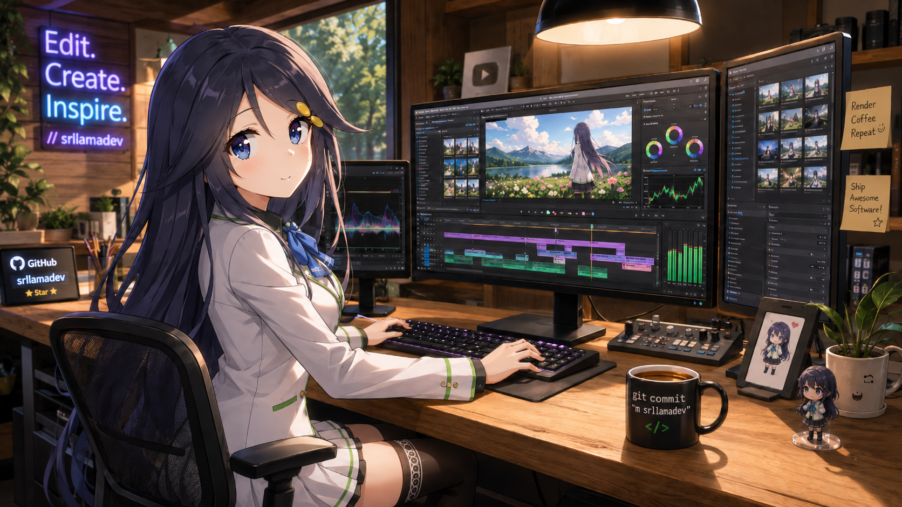

# ZeroLoss-Video-Cutter

A local application with a web interface for **cutting videos without quality loss** using FFmpeg (`-c copy`). 

Upload a video, select the start and end points, and generate the trimmed video next to the original file.

> Detailed installation guide for each operating system: [installation.md](installation.md)

## Requirements

* **Python 3.9+**
* **FFmpeg** (includes `ffmpeg` and `ffprobe`)

## Quick Installation

1. **Clone the repository**

```bash
git clone https://github.com/srllamadev/ZeroLoss-Video-Cutter.git
cd ZeroLoss-Video-Cutter
```

2. **Install FFmpeg**

* Windows: `winget install Gyan.FFmpeg`
* macOS: `brew install ffmpeg`
* Linux: `sudo apt install -y ffmpeg`

3. **Create a virtual environment and install the dependencies**

```bash
python -m venv venv

# Windows:
venv\Scripts\activate

# macOS/Linux:
source venv/bin/activate

python -m pip install -r requirements.txt
```

## Run the Application

**Windows (double-click):** Open `iniciar_app.bat`

**Manual execution on any operating system:**

```bash
python app.py
```

Open the following address in your browser: **http://127.0.0.1:8013**

## Usage

1. Drag and drop the video or click **Select Video**.
2. Move the sliders or enter the minutes and seconds manually.
3. Click **Cut Video**. The resulting file will be saved as `video_cut_1.mp4`, `video_cut_2.mp4`, and so on, in the same folder as the original video.
4. **View File** opens the resulting video, while **Open Folder** opens the file location and highlights the generated video in the file explorer.
